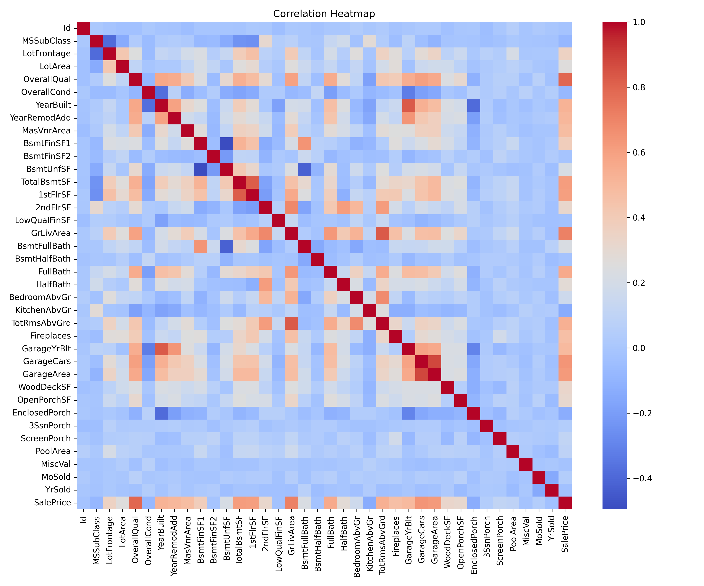
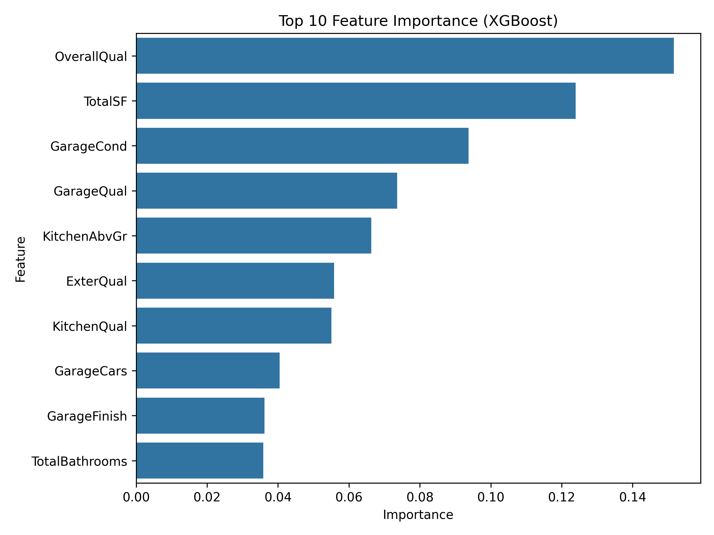

# House Prices Prediction using Machine Learning
An end-to-end machine learning project to predict residential house prices using regression and ensemble learning.


## Overview
This project predicts residential house prices using the Ames Housing dataset from Kaggle.
The objective is to build and compare multiple machine learning models, perform feature engineering, tune hyperparameters, and improve predictive performance using ensemble learning.

Dataset:
House Prices: Advanced Regression Techniques (Kaggle)


## Problem Statement
Predict the final sale price of residential homes in Ames, Iowa using various property features.


## Dataset
The dataset used in this project is publicly available through the Kaggle House Prices competition.
[Download Dataset](https://www.kaggle.com/competitions/house-prices-advanced-regression-techniques/data)

- Training samples: 1460
- Test samples: 1459
- Features: 79 (before preprocessing)

Target Variable:
- SalePrice

> **Note:** The original dataset is not included in this repository and can be downloaded directly from the Kaggle competition page.


## Exploratory Data Analysis
The following analyses were performed:

- Distribution of SalePrice
- Correlation Heatmap
- Missing Value Analysis
- Outlier Detection
- Feature Relationships


## Correlation Heatmap



## Data Preprocessing

### Missing Values
Missing values were handled using appropriate strategies:
- Numerical features → Median / Zero
- Categorical features → Mode / "None"

### Outlier Removal
Two extreme outliers were removed:
- Row 523
- Row 1298

### Feature Engineering
The following new features were created:
- HouseAge
- YearsSinceRemodel
- TotalSF
- TotalBathrooms

### Encoding
- Ordinal Encoding
- One-Hot Encoding

### Target Transformation
The target variable was transformed using:
```python
np.log1p(SalePrice)
```
to reduce skewness and improve model performance.


## Models Used
- Linear Regression
- Random Forest
- XGBoost
- LightGBM
- CatBoost
- Ensemble Learning


## Feature Importance



## Hyperparameter Tuning
RandomizedSearchCV with 5-Fold Cross Validation was used for tuning:

- Random Forest
- XGBoost
- LightGBM
- CatBoost


## Model Performance
| Model             | Validation RMSE | Kaggle Score |
| ----------------- | --------------: | -----------: |
| Linear Regression |          0.1326 |            - |
| Random Forest     |          0.1490 |            - |
| XGBoost           |          0.1233 |      0.13290 |
| LightGBM          |          ~0.123 |      0.13144 |
| CatBoost          |          0.1234 |      0.13159 |
| **Ensemble**      |               - |  **0.12781** |


## Technologies Used
- Python
- Pandas
- NumPy
- Matplotlib
- Seaborn
- Scikit-Learn
- XGBoost
- LightGBM
- CatBoost


## Key Results
- Achieved a Kaggle leaderboard score of **0.12781** using an ensemble of XGBoost, LightGBM, and CatBoost.
- Performed feature engineering by creating `HouseAge`, `YearsSinceRemodel`, `TotalSF`, and `TotalBathrooms`.
- Tuned multiple gradient boosting models using RandomizedSearchCV with 5-fold cross-validation.
- Compared baseline and advanced machine learning models to evaluate performance improvements.


## Future Improvements
- Weighted ensemble learning
- Stacking
- Bayesian Hyperparameter Optimisation (Optuna)
- Additional Feature Engineering
- Streamlit Deployment


## Kaggle Competition
🔗 [House Prices: Advanced Regression Techniques](https://www.kaggle.com/competitions/house-prices-advanced-regression-techniques)


## Author
**Anshika**

Feel free to connect or provide feedback through GitHub.
